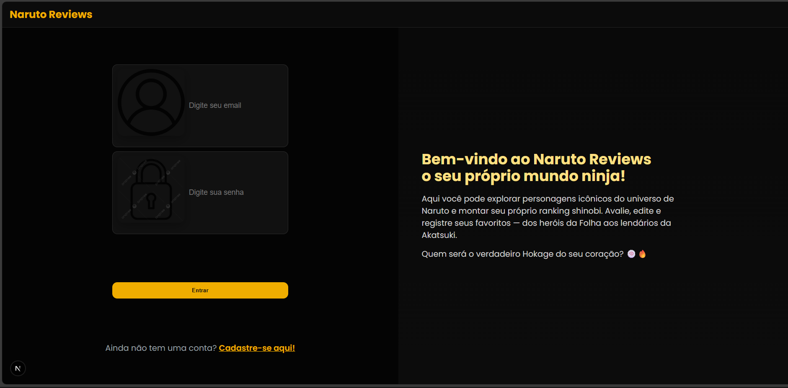
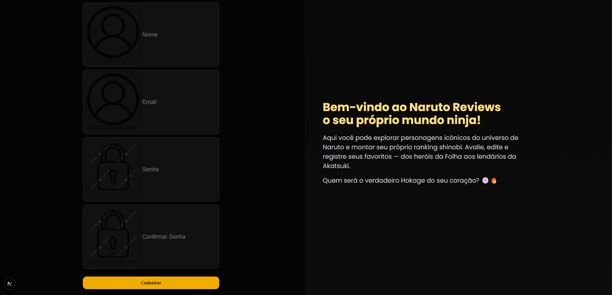
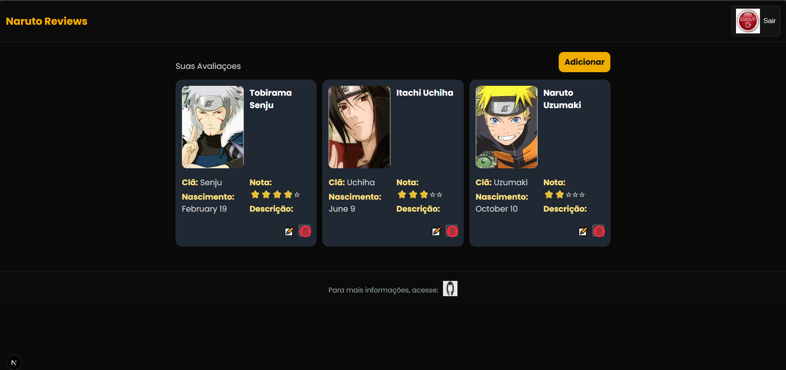
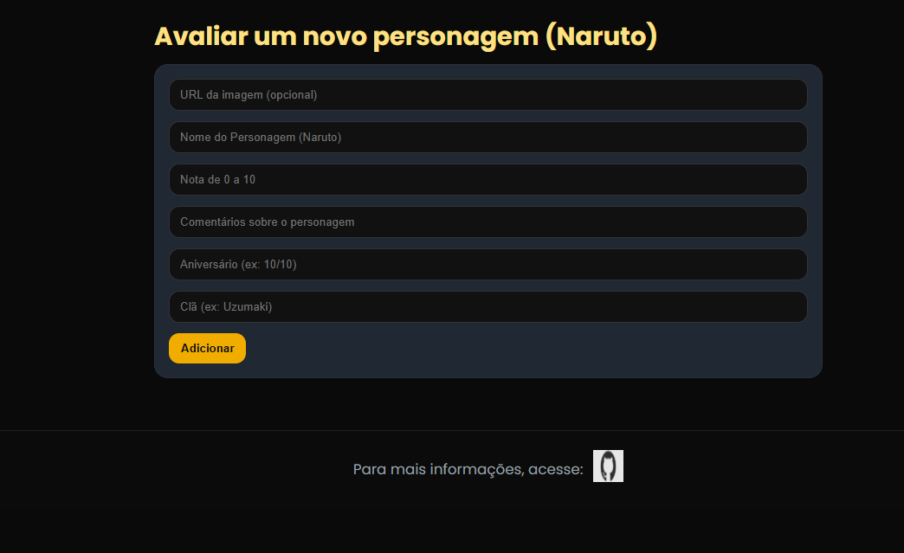

# Naruto Reviews

Uma aplicação Next.js para gerenciar e avaliar personagens do anime Naruto. Permite que usuários se cadastrem, façam login e gerenciem uma coleção personalizada de personagens com reviews e informações detalhadas.

##  Funcionalidades

- **Autenticação de Usuários**
  - Cadastro (com validação de email duplicado)
  - Login com sessão segura
  - Logout
  
- **Gerenciamento de Personagens**
  - Visualizar personagens da API do Naruto
  - Adicionar personagens favoritos à coleção pessoal
  - Editar informações dos personagens
  - Deletar personagens da coleção
  - Busca com autocomplete de personagens

- **Interface Responsiva**
  - Design dark mode inspirado em Naruto
  - Layout responsivo (desktop e mobile)
  - Transições e efeitos visuais suaves

##  Stack Tecnológico

- **Frontend**: React 19, Next.js 15
- **Styling**: CSS moderno com variáveis e media queries
- **Segurança**: bcrypt para hash de senhas, JWT para sessões
- **Validação**: Zod para schema validation
- **HTTP**: Axios para requisições
- **Notificações**: React Hot Toast
- **Tipagem**: TypeScript

##  Dependências

```json
{
  "dependencies": {
    "axios": "^1.10.0",
    "bcrypt": "^6.0.0",
    "jose": "^6.0.11",
    "next": "15.3.5",
    "react": "^19.0.0",
    "react-dom": "^19.0.0",
    "react-hot-toast": "^2.5.2",
    "zod": "^3.25.74"
  }
}
```

##  Como Executar

### Pré-requisitos
- Node.js 18+
- npm ou yarn

### Instalação

```bash
# Clonar repositório
git clone https://github.com/Davi751607/naruto-reviews.git
cd naruto-reviews

# Instalar dependências
npm install

# Executar em desenvolvimento
npm run dev

# Build para produção
npm build

# Iniciar produção
npm start
```

A aplicação estará disponível em `http://localhost:3000`

## Estrutura do Projeto

```
src/
├── app/
│   ├── (auth)/
│   │   ├── login/        # Página de login
│   │   └── create/       # Página de cadastro
│   ├── dashboard/
│   │   ├── page.tsx      # Dashboard principal
│   │   ├── create/       # Criar novo personagem
│   │   └── edit/[id]/    # Editar personagem
│   ├── db/
│   │   ├── usuarios-db.json      # Banco de usuários
│   │   └── character-db.json     # Banco de personagens
│   ├── libs/
│   │   ├── credentials.ts        # Funções de autenticação
│   │   ├── conexao-bd.ts         # Conexão com banco de dados
│   │   ├── session.ts            # Gerenciamento de sessão
│   │   ├── add-char.ts           # Funções de personagens
│   │   ├── narutoapi.ts          # Integração com API do Naruto
│   │   └── naruto-names.ts       # Lista de nomes do Naruto
│   ├── styles/
│   │   ├── login.css             # Estilos da autenticação
│   │   ├── dashboard.css         # Estilos do dashboard
│   │   ├── characters.css        # Estilos dos cards de personagens
│   │   ├── create-character.css  # Estilos do formulário
│   │   ├── header.css            # Estilos do header
│   │   ├── footer.css            # Estilos do footer
│   │   └── autocomplete.css      # Estilos do autocomplete
│   └── ui/
│       ├── header.tsx            # Componente header
│       ├── footer.tsx            # Componente footer
│       ├── characters.tsx        # Componente de cards
│       └── autocompleteInput.tsx # Componente autocomplete
```

##  Segurança

- Senhas são criptografadas com bcrypt (10 rounds)
- Sessões são gerenciadas com JWT (jose)
- Validação de entrada com Zod
- Middleware de autenticação
- Variáveis de ambiente para dados sensíveis

## Character

 {
    "id": "fd7d070a-c584-4822-9786-eb2302cb90c2",
    "nome": "Tobirama Senju",
    "nota": 8,
    "descricao": "",
    "img": "https://cdn.myanimelist.net/images/characters/2/293367.webp",
    "aniversario": "February 19",
    "cla": "Senju"
  },

## Usuários
{   "id": "76d0d5cc-1754-4773-979a-11591fd0da89",
    "nome": "Patricki",
    "email": "patrickicosta0@gmail.com",
    "password": "$2b$10$Y61sK1wldxNEOrBXQmX6O.OGwfSPEuIzDLZgg5IaeMd9D8EFb3ql2"
},

## Design

- **Cores Principal**: 
  - Amarelo Naruto: `#f0ad00`
  - Fundo escuro: `#0b0b0b`, `#111`
  - Cinza de texto: `#eee`, `#d2d2d2`

- **Tipografia**: Sistema de fontes do navegador (system-ui fallback)

- **Componentes**:
  - Inputs com validação visual
  - Botões com efeitos hover/active
  - Cards com box-shadow
  - Transições suaves (0.1s - 0.2s)


## 📸 Screenshots

### Página de Login
*Formulário de login com autenticação segura e validação de credenciais*


### Página de Registro
*Formulário de cadastro com validação de email, senha e campo de nome*


### Dashboard
*Painel principal com lista de personagens cadastrados e opções de gerenciamento*


### Criar Personagem
*Formulário para adicionar novos personagens com busca por autocomplete da API do Naruto*


### Editar Personagem
*Interface para editar informações dos personagens já cadastrados*


## 🔧 Configuração de Variáveis de Ambiente

Crie um arquivo `.env.local` na raiz do projeto com as seguintes variáveis:

```env
# Chave de criptografia JWT para gerenciamento de sessões
NEXT_PUBLIC_JWT_SECRET=sua_chave_secreta_super_segura_aqui

# URL base da API do Naruto (opcional, use a padrão se não configurar)
NEXT_PUBLIC_NARUTO_API_URL=https://narutodb.xyz

# Porta da aplicação (padrão: 3000)
NEXT_PUBLIC_PORT=3000
```

### Explicação das Variáveis:

- **NEXT_PUBLIC_JWT_SECRET**: Chave secreta usada para criptografar e descriptografar os tokens JWT. Deve ser uma string aleatória e segura. Esta chave é essencial para a segurança das sessões dos usuários.

- **NEXT_PUBLIC_NARUTO_API_URL**: URL base da API do Naruto utilizada para buscar dados de personagens. A aplicação usa a API pública do Naruto (narutodb.xyz) para autocompletar nomes de personagens.

- **NEXT_PUBLIC_PORT**: Porta na qual a aplicação será executada em desenvolvimento. O valor padrão é 3000.

>  **Importante**: Nunca compartilhe ou commite o arquivo `.env.local` no repositório. Use `.env.example` como referência.

##  Autor

Desenvolvido por Davi751607
Desenvolvido por Patricki99

##  Contato

- GitHub: [@Davi751607](https://github.com/Davi751607) - Backend
- Github: [@Patricki99](https://github.com/Patricki99) - Frontend

---

**Desenvolvido com ❤️ | Naruto Reviews**
